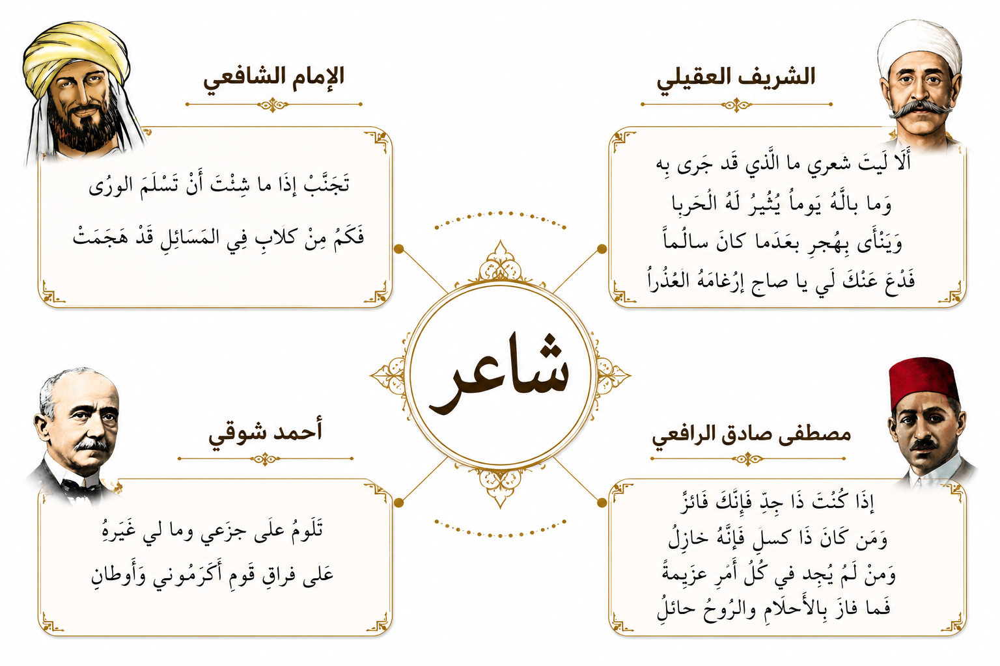
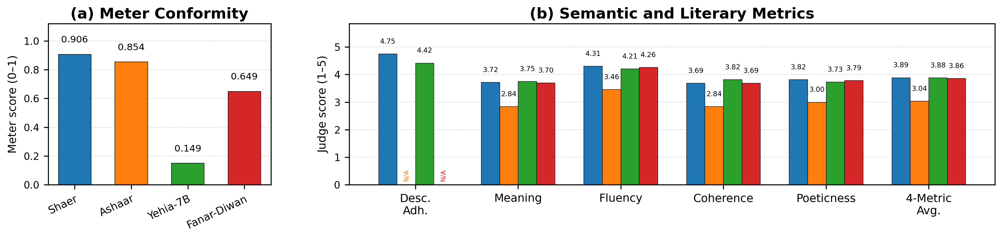

# Shaer

**Shaer** is a controllable classical Arabic poetry generation project built on top of `Navid-AI/Yehia-7B-preview`. The paper setup conditions generation on:

- `base_meter`
- `form` (meter sub-form)
- requested number of hemistichs
- a natural-language semantic description

This repository is the paper-faithful public release. It contains the dataset construction pipeline, the exact SFT training code, the baseline evaluation workflows, the strict LLM-judge prompts, and lightweight Colab entrypoints.

## Release overview

The release aligns with the paper:

- cleaned classical-poetry corpus with normalized meter sub-forms
- semantic description generation and verification pipeline
- QLoRA-based SFT over Yehia-7B
- direct one-row-per-prompt benchmark datasets
- structural evaluation (`meter`, `count_adherence`)
- strict LLM-based evaluation (`description_adherence`, `meaning`, `fluency`, `coherence`, `poeticness`)

The paper reports:

- **116,032** structurally filtered classical poems after corpus cleaning
- **114,065** verified-description rows retained for downstream training after description verification
- **13** classical base meters
- **21** meter sub-form combinations

## Main results

Final evaluation uses direct held-out benchmark datasets with `3,481` generations per system.

| Model | Meter | Meaning | Fluency | Coherence | Poeticness | Description Adherence |
|---|---:|---:|---:|---:|---:|---:|
| `Shaer` | `0.9064` | `3.72` | `4.31` | `3.69` | `3.82` | `4.75` |
| `Yehia-7B` | `0.1494` | `3.75` | `4.21` | `3.82` | `3.73` | `4.42` |
| `Fanar-Diwan` | `0.6488` | `3.70` | `4.26` | `3.69` | `3.79` | `N/A` |
| `Ashaar` | `0.8535` | `2.84` | `3.46` | `2.84` | `3.00` | `N/A` |

Shared 4-metric average (`meaning`, `fluency`, `coherence`, `poeticness`):

1. `Shaer` - `3.89`
2. `Yehia-7B` - `3.88`
3. `Fanar-Diwan` - `3.86`
4. `Ashaar` - `3.04`

Paper-facing result note:

> Shaer preserves strong literary quality relative to Yehia while substantially improving formal metrical control.

## Released artifacts

### Models

- [`Shaer-AI/Shaer-adapters`](https://huggingface.co/Shaer-AI/Shaer-adapters) - released SFT adapter
- Base model used for SFT: [`Navid-AI/Yehia-7B-preview`](https://huggingface.co/Navid-AI/Yehia-7B-preview)

### Training datasets

- [`Shaer-AI/ashaar-with-enhanced-descriptions-baseform-final-sft-lte20-min500`](https://huggingface.co/datasets/Shaer-AI/ashaar-with-enhanced-descriptions-baseform-final-sft-lte20-min500)
- [`Shaer-AI/ashaar-with-enhanced-descriptions-baseform-final-sft-lte20-min500-splits`](https://huggingface.co/datasets/Shaer-AI/ashaar-with-enhanced-descriptions-baseform-final-sft-lte20-min500-splits)

### Evaluation datasets

- `Shaer-AI/shaer-sft-test`
- `Shaer-AI/shaer-eval-ashaar-native-controls`
- `Shaer-AI/shaer-eval-instruction-yehia-base-sft-chat-template`
- `Shaer-AI/fanar-eval-native-prompt`

These are the benchmark datasets used in the paper evaluation workflow. Public readers should treat the public training split and model page as the primary click-through artifacts from this README.

## Try on Colab

- [Use intended prompt for best performance](https://colab.research.google.com/github/AhmaddAbbass/Shaer/blob/main/colab/shaer_use_intended_prompt_for_best_performance.ipynb)

The notebook is a lightweight entrypoint, not a full reproduction. It is meant to let readers:

- load the released adapter
- use the exact intended prompt format from the released pipeline
- pull real prompt examples from the released split dataset's `test` split
- generate a poem from meter/form/length/description with the paper-facing setup

## Reproducing the paper

### 1. Dataset curation and semantic descriptions

Start here:

- [description_generation/README.md](./description_generation/README.md)

Exact core files:

- [description_generation/final_sft_dataset.py](./description_generation/final_sft_dataset.py)
- [description_generation/regenerate_descriptions.py](./description_generation/regenerate_descriptions.py)
- [description_generation/prompt_contracts.py](./description_generation/prompt_contracts.py)

These files cover:

- corpus filtering
- meter/form normalization
- semantic description generation
- description verification and regeneration
- final SFT text assembly

### 2. Supervised fine-tuning

Start here:

- [sft/README.md](./sft/README.md)

Exact core files:

- [sft/train_sft.py](./sft/train_sft.py)
- [sft/sft_config.yaml](./sft/sft_config.yaml)
- [train_sft_qlora.py](./train_sft_qlora.py)
- [sft/split_utils.py](./sft/split_utils.py)

The released SFT baseline is trained with:

- QLoRA
- completion-only loss
- weighted sampling by `base_meter || form || length_bucket`
- deterministic `94/3/3` splits

### 3. Baseline generation

Start here:

- [evaluate others/README.md](./evaluate%20others/README.md)

Exact core files:

- [evaluate others/generate_ashaar_native_baselines.py](./evaluate%20others/generate_ashaar_native_baselines.py)
- [evaluate others/generate_instruction_baselines.py](./evaluate%20others/generate_instruction_baselines.py)
- [evaluate others/generate_continuation_baselines.py](./evaluate%20others/generate_continuation_baselines.py)
- [evaluate others/score_baseline_meter_count.py](./evaluate%20others/score_baseline_meter_count.py)

### 4. Evaluation

Start here:

- [evaluation/README.md](./evaluation/README.md)

Structural evaluation:

- [evaluation/metrics.py](./evaluation/metrics.py)
- [evaluation/score_meter_count.py](./evaluation/score_meter_count.py)

Strict LLM-judge evaluation:

- [evaluation/judge_prompts_v2_strict.yaml](./evaluation/judge_prompts_v2_strict.yaml)
- [evaluation/judge_llm.py](./evaluation/judge_llm.py)
- [evaluation/full_judge_orchestrator.py](./evaluation/full_judge_orchestrator.py)
- [evaluation/full_judge_worker.py](./evaluation/full_judge_worker.py)

Final reported result notes:

- [evaluation/judge_choice.md](./evaluation/judge_choice.md)
- [evaluation/results2.md](./evaluation/results2.md)

## Repository map

- [description_generation/](./description_generation/) - corpus construction, regenerated descriptions, final SFT text assembly
- [sft/](./sft/) - final supervised fine-tuning code and configs
- [evaluate others/](./evaluate%20others/) - baseline generation and normalization workflows
- [evaluation/](./evaluation/) - structural scoring, strict LLM-judge evaluation, final result notes
- [colab/](./colab/) - lightweight public notebooks for generation and dataset inspection
- [grpo/](./grpo/) - exploratory follow-up RL code, not part of the paper's core reported method

## Additional reference docs

- [START_HERE.md](./START_HERE.md)
- [training_details.md](./training_details.md)

## Notes

- This public repo intentionally reflects the paper-faithful workflow.
- Older multi-sample evaluation workflows are intentionally absent from the public history.
- GRPO code is kept as follow-up research material, not as the core reported method in the paper.
