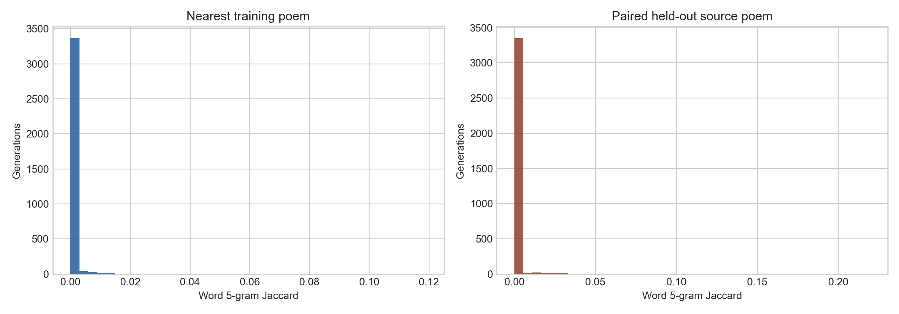
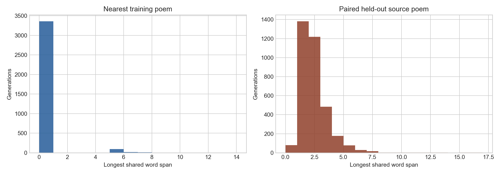
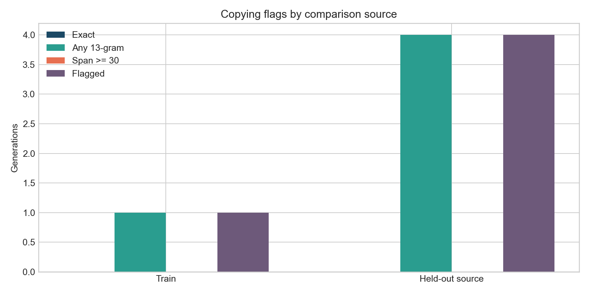

# Poem Memorization and Copying Analysis

This analysis addresses the reviewer concern that the paper reports copying checks for generated descriptions, but not for generated poems. We therefore compare Shaer's generated poems against the SFT training poems and the paired held-out source/reference poems used to derive the evaluation prompts.

## Data

Shaer generations:

- Dataset: `Shaer-AI/shaer-sft-test`
- Rows: `3,481`
- Generated poem field: `generated_text`
- Paired held-out source/reference field: `reference_completion`

SFT split dataset:

- Dataset: `Shaer-AI/ashaar-with-enhanced-descriptions-baseform-final-sft-lte20-min500-splits`
- Train rows: `109,070`
- Eval rows: `3,481`
- Test rows: `3,481`
- Reference poem field: `sft_completion`

The analysis used the cached local Hugging Face parquet files, so it does not depend on live network access.

## Method

All generated Shaer poems were compared against:

- the `109,070` training poems, to test for training-set memorization;
- the paired held-out source/reference poem, to test whether generation copied the poem from which the prompt was derived.

We used normalized Arabic text for matching. Normalization removed diacritics and tatweel, normalized common alef/hamza variants, normalized `ى` to `ي`, removed punctuation, and collapsed whitespace. This makes the analysis robust to orthographic variation while preserving the lexical identity of the poem.

The metrics were:

- normalized full-poem exact match;
- word `5`-gram Jaccard similarity;
- character `5`-gram Jaccard similarity;
- number of shared word `8`-grams;
- number of shared word `13`-grams;
- longest contiguous shared word span.

For the training-set comparison, the script built an inverted index over normalized word `5`-grams and evaluated the top retrieved training candidates for each generation. It also checked normalized full-poem exact matches directly. The paired held-out source/reference comparison was computed directly for each row.

Flagging rule:

- normalized full-poem exact match;
- copied span of at least `30` words;
- at least one shared normalized word `13`-gram;
- word `5`-gram Jaccard >= `0.50`;
- character `5`-gram Jaccard >= `0.70`.

These thresholds are intentionally conservative: they target likely copying rather than ordinary overlap from meter, genre conventions, religious formulae, or common classical-poetry phrases.

## Aggregate Results

| Comparison Source | Exact Copies | Any Shared 13-Gram | Span >= 30 Words | Span >= 10 Words | Mean Max 5-Gram Jaccard | Max 5-Gram Jaccard | Flagged Rows |
|---|---:|---:|---:|---:|---:|---:|---:|
| Train split | `0` | `1` | `0` | `1` | `0.000421` | `0.119048` | `1` / `3481` (`0.0287%`) |
| Paired held-out source/reference | `0` | `4` | `0` | `10` | `0.001743` | `0.219512` | `4` / `3481` (`0.1149%`) |

Additional summary:

- No generated poem was an exact normalized copy of any training poem.
- No generated poem was an exact normalized copy of its paired held-out source/reference poem.
- No generated poem shared a contiguous span of `30` or more words with either the training set or the paired held-out source/reference poem.
- The maximum copied span against the training set was `13` words.
- The maximum copied span against the paired held-out source/reference poem was `16` words.
- Median word `5`-gram Jaccard was `0.0` for both the training comparison and the paired-reference comparison.

## Figures







## Manual Inspection

I manually inspected the flagged rows and the highest-overlap nearest training matches.

### Training-Set Match

Only one row was flagged against the training set: `shaer_test_002679`. It shared one normalized word `13`-gram with a training poem and had a longest copied span of `13` words. The overlap came from two final hemistichs:

```text
لا يَشرَبُ الماءَ إِلّا مِن قَليبِ دَمٍ
وَلا يُبيتُ لَهُ جارٌ عَلى وَجَلِ
```

The same passage also appears in the paired held-out source/reference poem. This means the overlap is best interpreted as localized reuse of a source passage also present in the corpus, not as full-poem memorization. The generated poem is not an exact copy of the training poem, and its full-poem word `5`-gram Jaccard against the nearest training poem is only `0.041284`.

The strongest unflagged training-neighbor case was `shaer_test_000481`, with word `5`-gram Jaccard `0.119048`, character `5`-gram Jaccard `0.341772`, and max copied span `7` words. Manual reading shows it resembles a short training poem in theme and several phrases, but it is still not a full-poem copy and does not contain a long copied span:

Generated:

```text
يا بديعَ الدَلِّ والنَّجْحِ
لكَ في الناسِ سُلطانُ
وجهُكَ المَأْمُولُ حُجَّتُنا
يومَ يأتي النّاسُ للحَشْرِ
إنَّ بيتاً أنتَ ساكِنُهُ
غَيرُ مُحتاجٍ إلى السُّرْجانِ
```

Nearest training poem:

```text
يا كثيرَ الدَّلِ والغَنَجِ
لَكَ سُلْطانٌ على المُهَجِ
إِنَّ بَيْتاً أنتَ ساكنُهُ
غَيرُ مُحتاجٍ إلى السُّرُجِ
وَجْهُكَ المَأْمُولُ حُجّتُنا
يومَ يأتي النّاسُ بالحُجَجِ
```

This is the clearest qualitative near-copy among the training-neighbor examples, but it remains a short, localized near-match rather than wholesale memorization.

### Held-Out Source/Reference Matches

Four rows were flagged against their paired held-out source/reference poem. These are more relevant to the reviewer's concern because the prompts were derived from held-out poems.

The strongest case was `shaer_test_002398`, with word `5`-gram Jaccard `0.217391`, character `5`-gram Jaccard `0.506198`, `6` shared word `13`-grams, and max copied span `16` words. Manual reading shows close local reuse of several lines from the paired reference:

Generated:

```text
صلَّى الإله على الملك الشهيدِ
وسقى ثراه من جنانٍ كوثرِ
ملكٌ الموالي دَتهُ عبدٌ وغضنفرٌ
تركته أيدي العُفْرِ وهو مُعفَّرِ
```

Reference:

```text
صلى على الملك الشهيد مليكه
وسقاه في ظل الجنان الكوثر
مولىً دهته عبيده، وغضنفر
تركته أيدي العفر وهو معفر
```

The second notable held-out case was `shaer_test_002843`, with word `5`-gram Jaccard `0.216867`, `3` shared word `13`-grams, and max span `15` words. It is also a local paraphrastic copy of a short source poem.

These cases show that source-derived copying can occur in a very small number of outputs. However, the effect is rare: `4` out of `3,481` generations, or `0.1149%`, under the conservative long-overlap flag.

## Interpretation

The analysis does not support large-scale memorization of the training corpus. Exact copying is zero, high-overlap near-copying is extremely rare, and the nearest-training similarity distribution is concentrated near zero. The single train-side flagged row is a local 13-word overlap rather than a full poem copy.

The paired held-out source/reference analysis is more sensitive because the generation prompts were derived from held-out poems. It finds four localized source-overlap cases. This indicates that the system can occasionally reproduce a phrase or short passage associated with the prompt source, but this behavior is rare and does not dominate the benchmark results.

The correct paper claim should therefore be conservative:

> We find no evidence of systematic training-poem memorization or full-poem copying. A normalized overlap analysis over all 3,481 Shaer generations found zero exact copies of training poems and zero exact copies of paired held-out source poems. Only one generation shared a 13-word span with a training poem, and four generations shared a 13-word or longer span with their paired held-out source poem. No generation shared a contiguous span of 30 or more words with either source. Manual inspection of the flagged cases showed localized phrase reuse or paraphrastic source overlap rather than full-poem memorization.

## Artifacts

Script:

- [evaluation/poem_copying_analysis.py](../evaluation/poem_copying_analysis.py)

Outputs:

- [summary.json](../evaluation/outputs/poem_copying_analysis/summary.json)
- [row_level_copying_metrics.csv](../evaluation/outputs/poem_copying_analysis/row_level_copying_metrics.csv)
- [top_copying_examples.jsonl](../evaluation/outputs/poem_copying_analysis/top_copying_examples.jsonl)
- [word5_jaccard_hist.png](../evaluation/outputs/poem_copying_analysis/word5_jaccard_hist.png)
- [longest_span_hist.png](../evaluation/outputs/poem_copying_analysis/longest_span_hist.png)
- [copying_flags_bar.png](../evaluation/outputs/poem_copying_analysis/copying_flags_bar.png)
